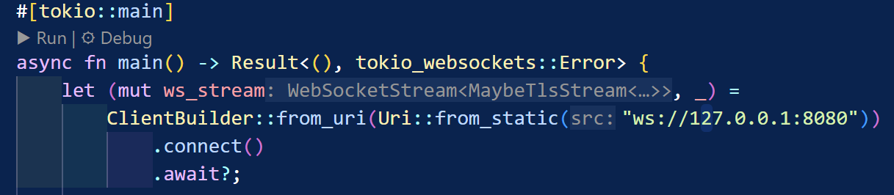

# Module 10
##### Deanita Sekar Kinasih
##### 2306229405

## Original code, and how it run

Saya menggunakan perintah `cargo run --bin server` untuk menjalankan server dan `cargo run --bin client` untuk menjalankan client. Ketika server dijalankan, muncul pesan "Listening on port 2000" yang menandakan server telah siap menerima koneksi dari client. Setiap kali ada client yang terhubung, server mencatat koneksi baru dengan pesan "New connection from 127.0.0.1:[port]" dengan nomor port yang berbeda-beda. Client yang berhasil terhubung dengan server akan menerima pesan "From server: Welcome to chat! Type a message".
Ketika client pertama mengirim pesan "hello from client 1", server menerima pesan tersebut dan melakukan broadcast ke semua client yang terhubung. Begitu juga ketika client kedua dan ketiga mengirimkan pesan, server akan meneruskan pesan-pesan tersebut ke seluruh client yang terhubung. Dari hasil percobaan terlihat bahwa server berhasil menangani multiple koneksi secara bersamaan dan mendistribusikan pesan dari satu client ke semua client lainnya.

## 2.2 Modifying the websocket port

Perubahan komunikasi antara server dan client dilakukan dengan mengubah port dari 2000 menjadi 8080. Pada sisi server, perubahan ini diterapkan dengan menggunakan `TcpListener` untuk melakukan binding ke port 8080. Untuk memastikan komunikasi berjalan dengan baik, diperlukan penyesuaian yang sama pada sisi client dengan menggunakan protokol `WebSocket` yang harus merujuk ke port yang sama (8080) agar dapat berkomunikasi dengan server. Apabila port yang digunakan berbeda antara server dan client, maka client tidak akan dapat menemukan server dan program tidak dapat berjalan sebagaimana mestinya. Ketika port pada file server dan client tidak sinkron, akan terjadi error koneksi sehingga komunikasi tidak akan terjalin. Dengan menerapkan perubahan port yang konsisten pada kedua sisi (server dan client), koneksi tetap dapat berjalan dengan lancar.

## 2.3: Small changes, add IP and Port

Pada sisi client, saya mengubah perintah cetak menjadi `println!("Dea's Computer - From server: {}", text)` untuk menambahkan identifikasi perangkat penerima. Kemudian pada sisi server, saya menambahkan `bcast_tx.send(format!("{addr}: {text}"))?` agar server mencantumkan alamat IP dan port client pengirim dalam setiap pesan yang di-broadcast. Hasil modifikasi ini membuat setiap pesan yang diterima client menampilkan informasi lengkap berisi alamat IP dan port client pengirim dalam setiap pesan, serta isi pesan dari client. Perubahan ini memperjelas komunikasi karena memudahkan setiap client untuk mengidentifikasi pengirim pesan dalam percakapan. 